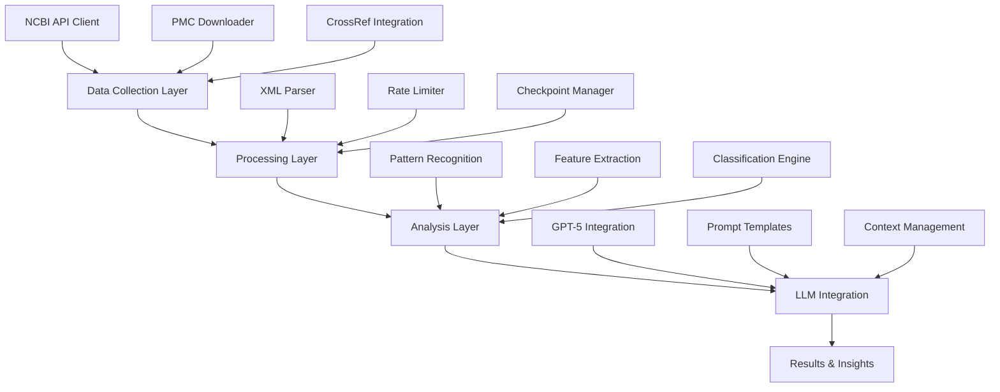

# 🧬 Agentic AI Against Aging: Advanced Aging Theories Identification System

> **A AI-powered system for comprehensive identification and analysis of aging theories from scientific literature, designed for the "Agentic AI Against Aging" hackathon.**

## 🌟 Stage

This part of the project represents a **approach to aging theory classification** using advanced LLM to analyze two distinct corpora of scientific literature. By leveraging **GPT-5 and other cutting-edge LLMs**, we systematically compare **true aging theory papers** against **false positive examples** to develop precise criteria for identifying aging-theory-related research and uncover critical edge cases that challenge traditional classification methods.

## 🚀 Key Features & Technical Excellence

### 🧠 **Advanced LLM Integration**
- **GPT-5 Powered Analysis**: Leverages the latest OpenAI GPT-5 model for sophisticated comparative analysis
- **Dual-Corpus Processing**: Simultaneously analyzes true aging theories vs false positives for pattern recognition
- **Context-Aware Processing**: Handles large document collections with intelligent token management
- **Edge Case Discovery**: Identifies challenging classification scenarios through advanced LLM reasoning

### 📊 **Comprehensive Data Collection Pipeline**
- **Multi-Source Integration**: Combines PubMed, PMC, and CrossRef APIs for complete paper metadata
- **Intelligent Rate Limiting**: Thread-safe rate limiting with exponential backoff for API reliability
- **Parallel Processing**: Multi-threaded batch processing for efficient large-scale data collection
- **Robust Error Handling**: Comprehensive retry logic and checkpoint management for fault tolerance

### 🔍 **Sophisticated Pattern Recognition**
- **Dual-Corpus Analysis**: Systematically compares true aging theories against false positives
- **LLM-Driven Criteria Development**: Uses advanced language models to identify distinguishing features
- **Multi-Dimensional Feature Extraction**: Analyzes titles, abstracts, full text, MeSH terms, citations, and metadata
- **Edge Case Identification**: Discovers challenging classification scenarios through comparative analysis

## 🛠️ Technical Architecture

### System Components



### 🏛️ **Modular Architecture**

```
paper_patterns/
├── 🧠 src/llm/              # LLM integration and analysis
│   ├── system.py            # Core LLM system
│   └── prompts.py           # Specialized prompt templates
├── 🔌 src/api/              # External API integrations
│   ├── ncbi_client.py       # NCBI Entrez API wrapper
│   └── rate_limiter.py      # Thread-safe rate limiting
├── 📥 src/collectors/       # Data collection modules
│   ├── paper_collector.py   # Comprehensive paper data collection
│   ├── pmc_downloader.py    # PMC full-text downloader
│   └── negative_collector.py # Negative examples collection
├── 🔍 src/parsers/          # Data parsing and extraction
│   └── xml_parser.py        # PMC XML parsing
├── ⚙️ config/               # Centralized configuration
│   └── settings.py          # All system settings
└── 📊 data/                 # Collected data and results
    ├── paper_data/          # Positive examples (golden set)
    ├── negative_examples/   # Negative examples for training
    └── llm_analysis_results/ # AI analysis outputs
```

### 🔬 Dual-Corpus Analysis Methodology

Our approach leverages **advanced LLMs to perform systematic comparative analysis** between two carefully curated corpora:

- **📚 True Aging Theories Corpus**: 61 confirmed aging theory papers (golden set)
- **❌ False Positives Corpus**: 24 carefully selected papers that appear related but are NOT aging theories

### **Why This Approach Works**

1. **Comparative Learning**: By analyzing both positive and negative examples simultaneously, LLMs can identify subtle distinguishing features that single-corpus analysis misses
2. **Edge Case Discovery**: The contrast between corpora reveals challenging classification scenarios
3. **Criteria Refinement**: Advanced reasoning identifies precise linguistic and structural patterns that distinguish aging theories
4. **Validation Framework**: The dual-corpus approach provides built-in validation for any developed criteria

## 🎯 Core Capabilities

### 1. **Dual-Corpus Comparative Analysis**
- **True vs. False Positive Analysis**: Systematically compares genuine aging theories against misleading examples
- **LLM-Driven Pattern Discovery**: Uses advanced language models to identify subtle distinguishing features
- **Criteria Refinement**: Develops precise classification criteria through comparative analysis
- **Edge Case Discovery**: Uncovers challenging scenarios that test classification boundaries

### 2. **Advanced LLM Reasoning**
- **GPT-5 Comparative Analysis**: Leverages state-of-the-art language models for sophisticated reasoning
- **Context-Aware Processing**: Maintains context across large document collections
- **Multi-Modal Analysis**: Combines text, metadata, and structural information for comprehensive evaluation
- **Reasoning Transparency**: Provides detailed explanations for classification decisions

### 3. **Criteria Development & Validation**
- **Feature Identification**: Discovers key characteristics that distinguish aging theories
- **Validation Framework**: Tests criteria against known positive and negative examples
- **Iterative Refinement**: Continuously improves classification accuracy through feedback
- **Generalization Testing**: Ensures criteria work across diverse paper types and domains

### 4. **Edge Case Analysis**
- **Boundary Testing**: Identifies papers that challenge classification boundaries
- **Ambiguity Detection**: Flags cases requiring human expert review
- **Pattern Anomalies**: Discovers unexpected patterns in aging theory literature
- **Classification Confidence**: Provides confidence scores for classification decisions

## 🚀 Getting Started

### Prerequisites
- Python 3.7+
- OpenAI API key
- NCBI API key (optional, for higher rate limits)

### Installation

```bash
# Clone the repository
git clone https://github.com/your-username/paper-patterns.git
cd paper-patterns

# Install dependencies
pip install -r requirements.txt

# Set up environment variables
cp .env.template .env
# Edit .env with your API keys
```

### Quick Start

```bash
# Run LLM analysis on collected papers
python scripts/run_llm_analysis.py --interactive

# Collect new papers from PubMed
python scripts/collect_papers.py --query "aging theory" --max-results 1000

# Download full texts from PMC
python scripts/download_full_texts.py --batch-size 50 --threads 4
```

## 🔧 Advanced Usage

### Custom Analysis

```python
from src.llm.system import PaperLLMSystem
from config.settings import PAPERS_DIR

# Initialize the system
llm_system = PaperLLMSystem(
    papers_dir=PAPERS_DIR,
    model="gpt-5",
    prompt_type="aging_theory_with_negatives_what_is_theory"
)

# Run custom analysis
response = llm_system.query("Analyze the evolutionary theories of aging")
print(response)
```

### Batch Processing

```python
from src.collectors.paper_collector import PaperCollector

# Collect papers in batches
collector = PaperCollector()
collector.process_dois_batch(doi_list, batch_size=20, num_threads=4)
```

